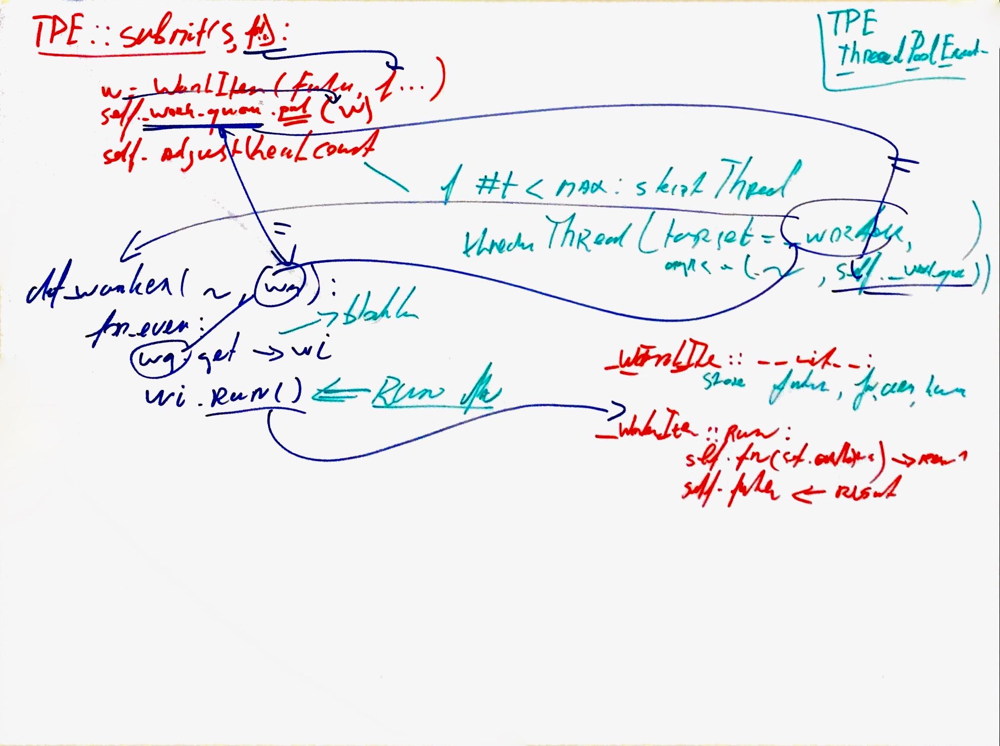
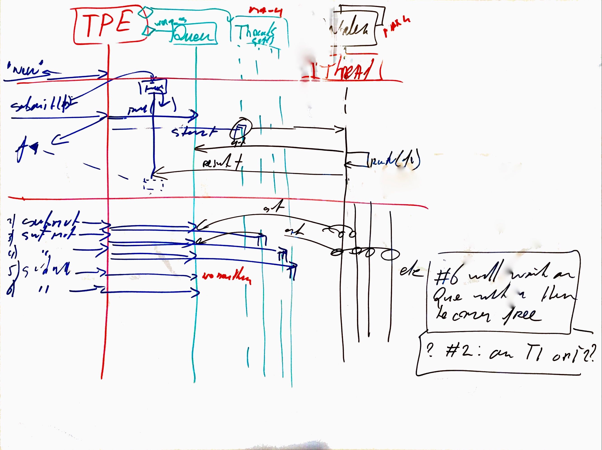

.. Copyright (C) 2020: ALbert Mietus.

.. _TPE_designboard:

===========
DesignBoard
===========

The dynamic behaviour can’t be extracted from the code; one has to *run* it. Often this is done by manually following
the most important functions. (So, not by executing it -- that give way to many details).

A very convenient procedure it to write-down the essential line of the method, and the methods that are called. Use
“arrows” to denote the flow. And elaborate when needed.
|BR|
By using a big whiteboard and many colors (and a brush!) the “flow” can be visualised.

See my analyse in this picture below

Next, this “curly flow” can be converted to a sequence-diagram. Preferable on a 2nd whiteboard. As shown below.

Last, and optional, we can convert it to (plant)UML

.. uml:: TPE_sequence.puml
