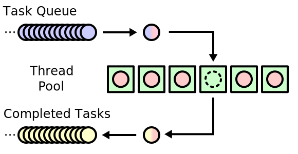

.. Copyright (C) 2017-2019: ALbert Mietus.

Concept
=======

Elke **worker** werkt concurrent (tov elkaar en het hoofdprogramma) en kan meerdere keren een
(soortgelijke) taak *na elkaar* uitvoeren. Zodra hij een taak krijgt toegewezen, werkt hij
uitsluitend (en typisch zonder onderbreking) aan die taak en maakt het resultaat zo snel mogelijk
beschikbaar. Daarna wacht hij op een nieuwe taak. Het aantal worker is typisch instelbaar; waarbij
het de kunst is om altijd minimaal één worker vrij te hebben.

   Concept met Threads, *afkomstig van wikimedia*

Een typisch implementatie heeft een queue voor nieuwe taken (de `work_queue`), een queue met
resultaten en een set van workers. Zodra een worker *beschikbaar* komt, pakt deze de volgende taak
uit de `work_queue`, gaat aan de slag en zet het resultaat in de tweede queue. Typisch in een
`forever-loop`, waarin hij alleen pauzeert als er niets in de `work_queue` staat.

Een wat uitgebreidere implementatie abstraheert van de queues. Die hebben immers locking nodig, wat
kan afgeschermd worden in de nette API-functie. Ook worden steeds vaker **future**-objecten
gebruikt; die bevatten *"het toekomstige resultaat van een asynchrone berekening”*. In sommige
programmertalen kunnen de taken zelfs “inline” gedefineerd worden. Dit alles maakt het concept
complexer, maar handiger in gebruik.

